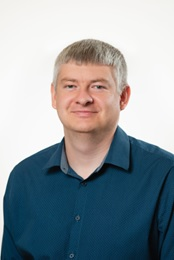
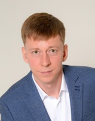
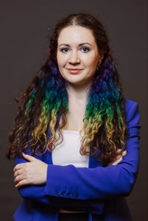

# CTO Community "Путь CTO"

## Кто мы

CTO Community — это сообщество CTO и других IT-управленцев: как действующих, так и тех, кто движется в эту роль.

Наше сообщество открыто для всех, кто может почерпнуть пользу от участия в нем.

Мы будем рады видеть здесь тимлидов, проектных/продуктовых/деливери менеджеров, архитекторов и HR компаний. Роль СТО сложна и многогранна, а значит у нас всегда будет много пересечений по интересам и рабочим задачам.

## Миссия сообщества

Мы создаём развивающую среду, где IT-лидеры делятся реальным опытом, получают поддержку сообщества и не остаются один на один с рабочими вызовами.

## Как мы понимаем развитие среды

Развитие среды для нас — это развитие в трёх измерениях:

### Люди
Сообщество помогает участникам расти, расширять кругозор, находить поддержку, обмениваться опытом и выстраивать полезные связи.

### Система
Сообщество не должно зависеть только от усилий нескольких организаторов.  
Мы хотим выстроить инфраструктуру, которая помогает активным участникам самим предлагать темы, запускать форматы и организовывать встречи.

### Энергетика
Нам важны культура, смыслы, мотивация и ощущение, что это не просто серия мероприятий, а живая среда, в которую хочется возвращаться и вкладываться.

## Что для нас важно

Основа сообщества — коммуникация и взаимодействие.

Наш основной фокус:
- обмен практическим опытом;
- профессиональный рост участников;
- взаимопомощь по рабочим и околорабочим вопросам;
- развитие круга доверительных профессиональных связей;
- создание среды, где можно обсуждать реальные вызовы и не оставаться с ними в одиночку.

## Чат сообщества
Присоединяйтесь к нашему [Telegram-чату](https://t.me/+Dgm2o8d5RahiZWZi). Здесь можно читать, писать свои мысли и комментарии, делиться идеями и проблемами друг с другом.

## Роль оффлайна

Оффлайн-встречи — основа сообщества.

Мы сознательно делаем ставку на регулярные личные встречи, потому что именно они лучше всего создают доверие, удерживают энергетику сообщества и дают пространство для настоящего обмена опытом.

Наша задача — сформировать привычку регулярно собираться оффлайн в формате митапов, небольших конференций или бизнес-ужинов. Ведь именно личное реальное общение дает тот самый простор для нетворкинга и реального обмена опытом между профессионалами.

## География сообщества

Мы родом из Санкт-Петербурга, но планируем мероприятия в Москве и других крупных городах где есть наши участники, а также активно используем онлайн-форматы.

## Наши правила

**Разрешено:**  

- Обсуждать новости и тренды мира IT  
- Говорить о темах менеджмента и стратегии, близких для СТО  
- Вести конструктивные дискуссии  
- Делиться своими историями, кейсами, проблемами и помогать с поиском решений задач коллег  
- Согласовывать и проводить дополнительные встречи и мастермайнды, сессии по разбору рабочих кейсов и проблем  
- Искать партнёров и коллег  

**Запрещено:** 
 
- Обсуждать политику, религию, личные предпочтения и другие триггерные темы   
- Хамить, оскорблять и использовать нецензурную брань  
- Откровенно хайрить и постить вакансии  
- Агрессивно продавать свои продукты или информационные ресурсы  

Нарушение правил может привести к бану.

## Оргкомитет

**Илья Прахт**  
  
СТО-консультант, опытный менеджер в IT, тренер. В прошлом СТО и СОО IT-компаний. Тренер обучающих программ для СТО, DM, ПМ и тимлидов в Стратоплане, OTUS, Eduson, ИТМО, OZON. Ментор и трекер.  

Контакты:  
- telegram: [@ilya_prakht](https://t.me/ilya_prakht)  
- [LinkedIn](https://www.linkedin.com/in/ilya-prakht/)  
- email: ilyaprakht@gmail.com  
- телефон: +7 962 629 65 72  
- tg-канал: @sedoydirector  

**Павел Турченко**  
    
CTO в BIV Group, почти 20 лет в ИТ и 10 в ИТ менеджменте, преимущественно в B2B / Fintech направлениях. Опыт в крупных международных компаниях (Deutsche Bank, IBM, Siemens) и небольших российских (BIV, Qvant), в управлении как внутренней, так и заказной разработкой. Прошёл путь от QA до CTO.  

Контакты:  
- Telegram: [@pturchenko](https://t.me/pturchenko)  
- [LinkedIn](https://www.linkedin.com/in/pavel-turchenko/)  
- Email: turchenko.pavel@gmail.com  
- телефон: +7 911 111 28 22  

**Елена Павлова**  
      
Руководитель отдела системного и бизнес-анализа в Positive Technologies, 14 лет в IT, член программного комитета конференции для системных и бизнес-аналитиков Flow.  

Контакты:  
- Telegram: [@elena_p_sa](https://t.me/elena_p_sa)  
- [LinkedIn](https://www.linkedin.com/in/elena-v-pavlova/)  
- Email: elena.zakhozhaya@gmail.com
- телефон: +7 911 245 41 09  

### Ближайшие мероприятия

- Планы формируются (2026)
- **ноябрь-декабрь** – митап (Москва).  
  

### Прошедшие мероприятия 2025г
- **Конец января** – бизнес-ужин (Санкт-Петербург).  
  Первая встреча: выбор названия, планов и целей сообщества.
- **Конец марта** – бизнес-ужин (Санкт-Петербург).  
  Вторая встреча: Планирование первого митапа.
- **21 апреля** – Первый митап (Санкт-Петербург)
  Обсуждение актуальных проблем и задач СТО, вызовов наступившего года.
- **12 сентября** – 2й митап сообщества Путь СТО (Санкт-Петербург)
  Развитие инженерной культуры, полезность и применимость ИИ на уровне компании и в работе СТО, Безопасная разработка ПО 
- **9 октября** – Стратегическая сессия по развитию (Санкт-Петербург).

### Партнеры

Здесь пока пусто. Мы всегда открыты к предложениям по партнерству :)

По всем вопросам пишите нам на почту cto.community@yandex.ru
